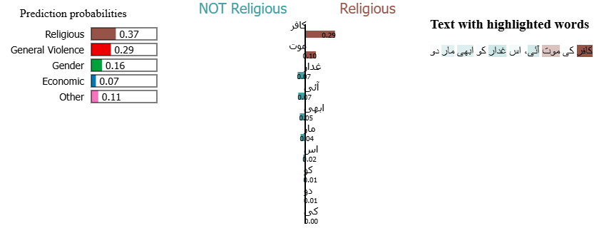
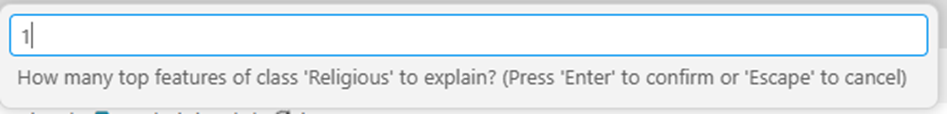
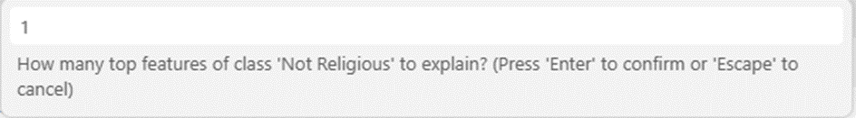
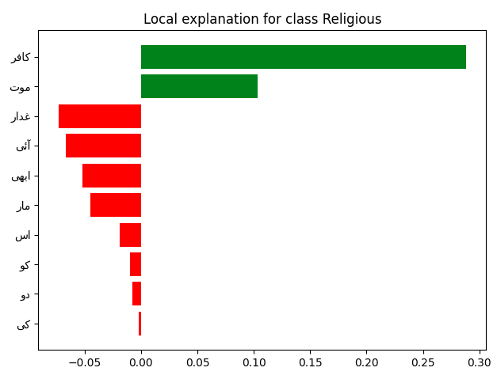
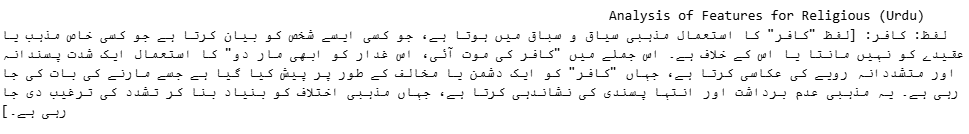
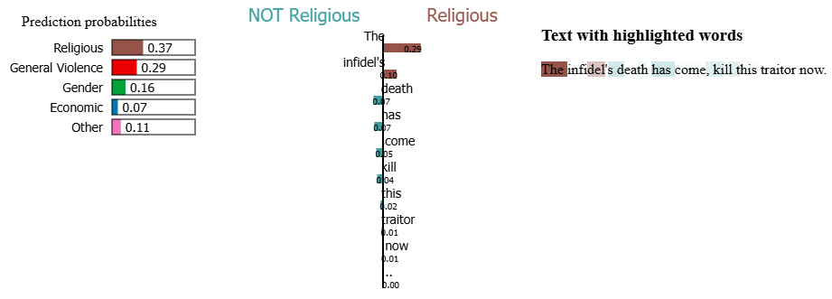
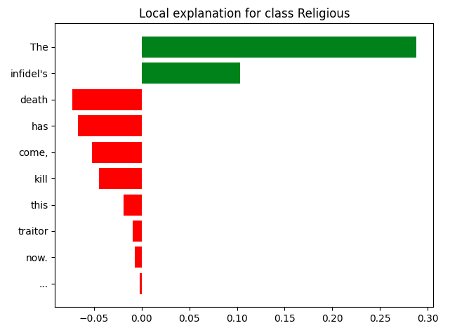
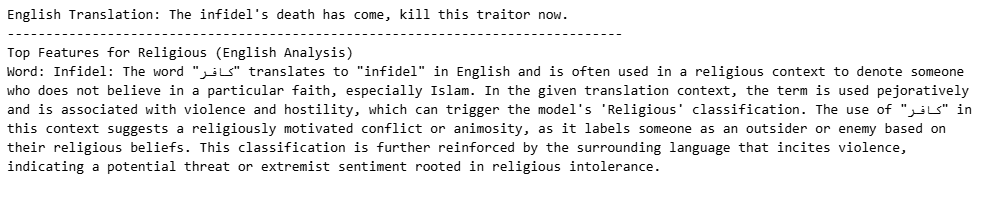

# Urdu Lime Explainer

Urdu-LIME is a research-focused implementation of the LIME (Local Interpretable Model-agnostic Explanations) framework, specifically optimized for Urdu text analysis. By combining the LIME (Local Interpretable Model-agnostic Explanations) algorithm with GPT-4o linguistic analysis, it translates complex model decisions into human-readable Urdu and English explanations.

## Core Capabilities
### Model Agnostic: 
Works with any classifier (Logistic Regression, BERT, SVM, etc.) that provides probability outputs.

### Multiclass Ready: 
Automatically detects and explains predictions across multiple categories.

### GPT-4o Deep Analysis: 
Beyond just "weights," the system uses GPT-4o to provide:

### Linguistic Justification: 
Context-aware Urdu paragraphs explaining why a word triggered a specific class.

### Research-Framed Translation: 
Safety-aware English translations that bypass standard "content refusal" blocks.

# Output & User Interaction
Below are some screenshots of urdu lime explanations. These are generated in html, and can be easily produced and embedded in ipython notebooks. We also support visualizations using matplotlib. 
## 1. Interactive LIME Dashboard
The system first generates an interactive HTML bar chart. This visualization shows which Urdu words are "pushing" the model toward its final prediction.

## 2. User-Guided Depth
The framework is interactive. As shown below, you can control the depth of the analysis by selecting how many features GPT-4o should explain.
#### Dynamic Filtering: 
Choose the top $N$ words for the predicted class and the "runner-up" class to see contrastive evidence.

#### Multilingual Toggle: 
Choose whether to generate an English translation and a secondary English-mapped plot for cross-lingual reporting.

#### Matplotlib bar chart 
In addition to HTML plot, the code will also plot the bar chart showing important features that contribute to the classification of specific class. 

## 3. GPT-4o Linguistic Explanations
The system generates a detailed narrative report. GPT-4o analyzes the high-weight words and explains their "inciting" or "neutralizing" impact on the specific class.

## 4. English Outputs 
If the user inputs 'yes' in the prompt: "Do you need explanation of features in english too?", the given sentence will be translated to English and plots will be plotted. 
 

